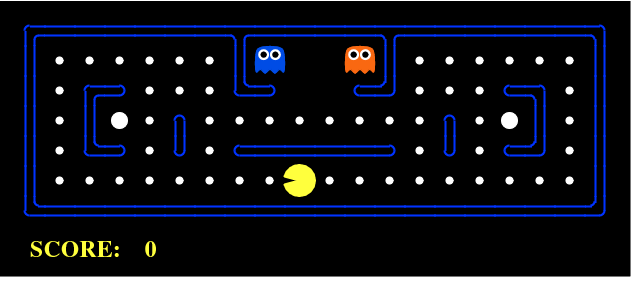

# TP 2 – Búsqueda (Pacman)
Inteligencia Artificial · UADE · Docente: Christian Parkinson

Implementación de 4 algoritmos de búsqueda para que Pacman encuentre el camino a la meta dentro de un laberinto, sobre el proyecto de Pacman AI de la Universidad de Berkeley (adaptado por Nelson Ponzoni para la cátedra).



- Enunciado: [`docs/enunciado-TP2-Busqueda.pdf`](docs/enunciado-TP2-Busqueda.pdf)
- Explicación paso a paso para la defensa: [`EXPLICACION.md`](EXPLICACION.md)

## Qué se implementó
Todo el trabajo está en **`search.py`**. El resto de los archivos es el juego que provee la cátedra.

| Función | Algoritmo | Frontera (de dónde saca el próximo estado) |
|---|---|---|
| `depthFirstSearch` | Profundidad (DFS) | Pila: sale el último que entró |
| `breadthFirstSearch` | Anchura (BFS) | Cola: sale el primero que entró |
| `uniformCostSearch` | Costo uniforme (UCS) | Cola de prioridad por costo acumulado |
| `aStarSearch` | A\* | Cola de prioridad por costo acumulado + heurística |

Los 4 hacen lo mismo: sacan un estado de la frontera, se fijan si es la meta y, si no, agregan sus vecinos. **Lo único que cambia es la frontera.**

## Resultados (todos ganan)
Costo del camino / nodos expandidos:

| Laberinto | DFS | BFS | UCS | A\* (Manhattan) |
|---|---|---|---|---|
| `tp2Maze` | 17 / 22 | 15 / 23 | 15 / 23 | 15 / **19** |
| `tinyMaze` | 10 / 15 | 8 / 15 | 8 / 15 | 8 / **14** |
| `mediumMaze` | 130 / 146 | 68 / 269 | 68 / 269 | 68 / **221** |
| `openMaze` | 298 / 576 | 54 / 682 | 54 / 682 | 54 / **535** |

## Cómo correrlo
Requiere Python 3. Doble clic en **`jugar.bat`**, o escribir `jugar` en `cmd` desde esta carpeta. Se abre un menú:
```
1) Ver el juego          (Pacman moviendose en una ventana)
2) Comparar algoritmos   (tabla con los numeros de los 4)
3) Salir
```
Atajo para abrir el juego directo: `jugar bfs mediumMaze`.
Qué se ve en cada caso: ver [`EXPLICACION.md`](EXPLICACION.md#qué-se-ve-al-correrlo).

También se puede llamar al juego directo:
```bash
python pacman.py -l tp2Maze -p SearchAgent -a fn=dfs
python pacman.py -l mediumMaze -p SearchAgent -a fn=bfs
python pacman.py -l mediumMaze -p SearchAgent -a fn=ucs
python pacman.py -l openMaze -p SearchAgent -a fn=astar,heuristic=manhattanHeuristic
```
Agregando `-q` corre en modo texto (rápido, sin ventana). Más comandos en [`commands.txt`](commands.txt).

## Estructura del proyecto
```
search.py            <- LO NUESTRO: los 4 algoritmos
EXPLICACION.md       <- guía para entender y defender el TP
jugar.bat            <- script para correr el juego fácil
commands.txt         <- comandos listos para probar

pacman.py            <- arranca el juego
searchAgents.py      <- el agente que llama a nuestras funciones de búsqueda
game.py, util.py     <- reglas del juego y estructuras (Stack, Queue, PriorityQueue)
layout.py            <- lee los mapas
pacmanAgents.py, ghostAgents.py, keyboardAgents.py   <- agentes del juego
graphicsDisplay.py, graphicsUtils.py, textDisplay.py <- pantalla
layouts/             <- mapas de laberintos (.lay); tp2Maze.lay es el laberinto chico de ejemplo
docs/                <- enunciado e imágenes
```
Los archivos del juego tienen que quedar todos en la misma carpeta: `pacman.py` los importa por nombre.

## Integrantes
- Martina Toffoletto
- Agustin Buset
- Elias Gantus
- Martina Castro
